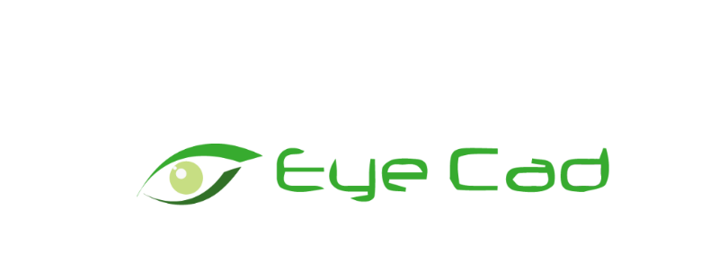
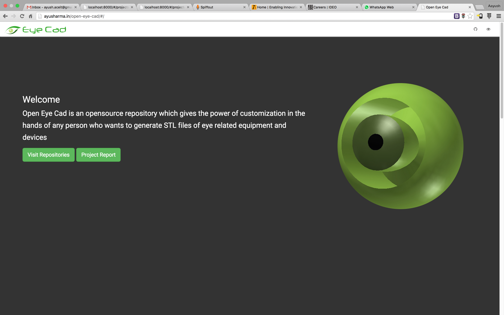
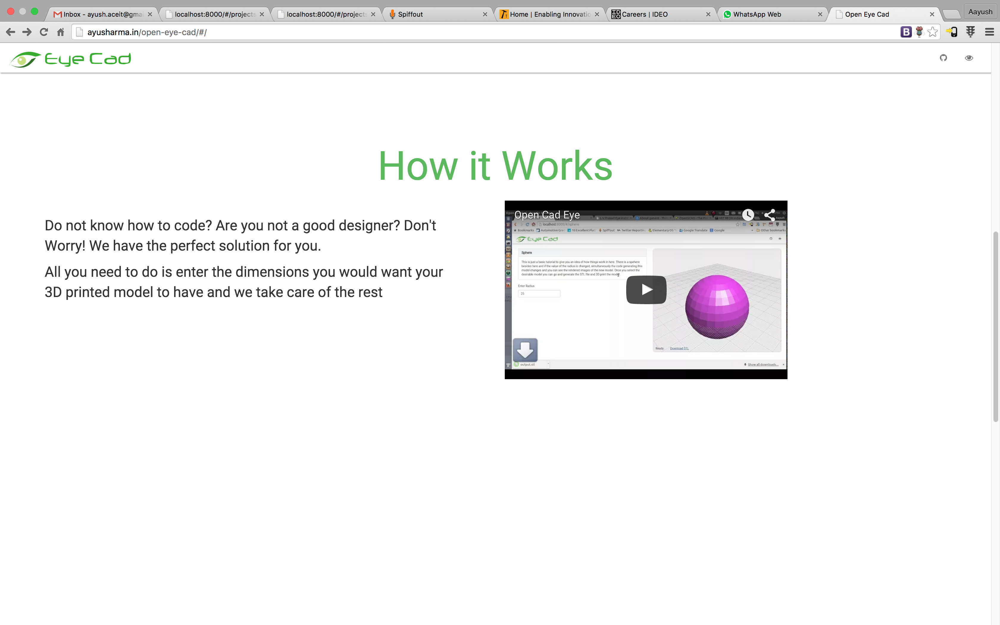
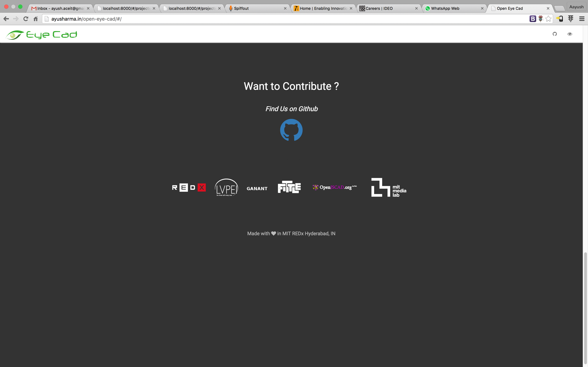
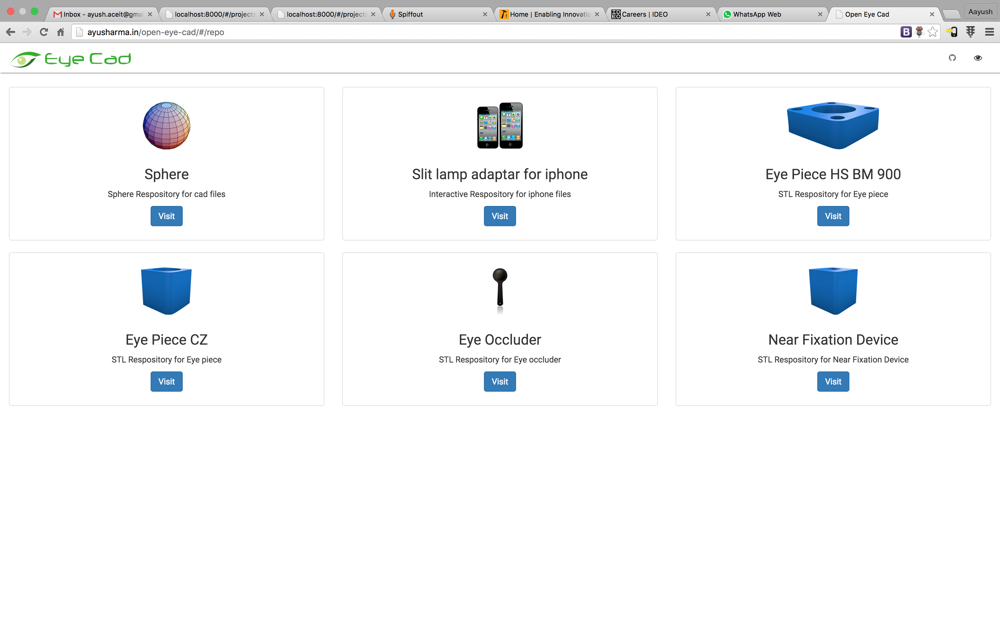
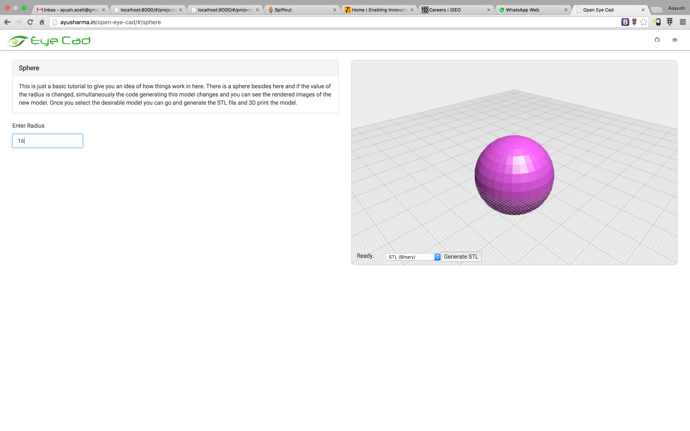
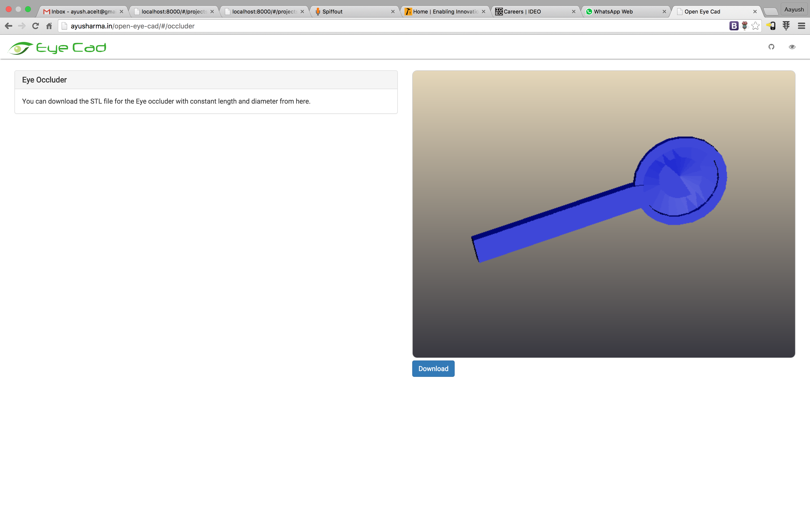

### Open Eye Cad
* * *
**Problem Statement**: An online repositories of 3D models exist, but customization and accessibility modify them is nonexistent. Files can be modified only by a proficient coder or a designer. For a normal person in the medical profession, there is no provision for customizing things. Hence the accessibility and use of something as efficient as 3D printing is a segment doctors still don’t touch.
**Solution**: Doctors and users can modify the models by changing just some parameters. The entire programming happens in the background. The modified rendered image can be viewed and the STL file generated, then and there itself. 5 years down the line, when 3D printers are going to be a household name, this platform will revolutionize accessibility, be cost effective and tackle sterility as well.

### MIT REDx
* * *
**GROUND UP & CO-INNOVATION**: We have built a platform that brings together technical experts, innovators, academic institutions, implementation partners and progressive corporate partners that will allow us to solve the most pressing challenges within India, and other developing countries. The focus is on finding solutions that help serve the "The Next 5 Billion" citizens by: Identifying community specific challenges that may have solutions that could also be applied to multiple locations. Providing mentorship, training and technical support from corporate partners, MIT and other leading institutions to assist innovators creating novel technical solutions for rapidly emerging and pop-up cities. Pairing innovators with implementation partners on the ground to ensure that each product responds to real needs and enters the market with speed and scale.

### The Team
* * *
I worked under the supervision of Tristan Swedish, Dr. Cathy Stern, Dr. Anthony Vipin Das, Sai Naga Sri Harsha C with a teammate. We have also introduced our project in the inauguration ceremony of T- Hub (a government of Telangana initiative, is India’s largest incubator for Startups).

### Screenshots
* * *

### Features
* * *
 - Simple & Easy to use.
 - Customization of modal in real time.
 - Live view of modal.
 - Generates STL format.

### Technology Stack
* * *
HTML CSS3 OpenJs Cad Angular JS GIMP

### Learning & Experience
* * *
Openeye Cad comprises various field of technologies like Computer Aided Designs, Web platform, 3D Printing and Health.
 - Leaned about anatomy of a Human Eye.
 - Field visit and Problem solving activities in LV Prasad Eye Institute, Hyderabad.
 - Group Discussions, Meet up with creative people.
 - Analyzed problems faced by blind people.
 - CAD & Designing and Concepts of 3D printing.
 - Learned about Optics+Human Eye.
 - Fundus Photography.
 - MIT initiatives, Smart cities and Health care.

### Future Work
* * *
Currently we have made a basic web repository with just a couple of models and a tutorial to start with. Each and every model of any device that can be 3D printed needs to be coded and then corresponding variables be introduced as parameters so that any change by the user modifies and generates the rendered image all in the background. Hence, the code for models need to be developed with open source participation from as many people around the world as possible. Development of a software with an existing CAD platform to automatically generate parametric code is one prime target.
